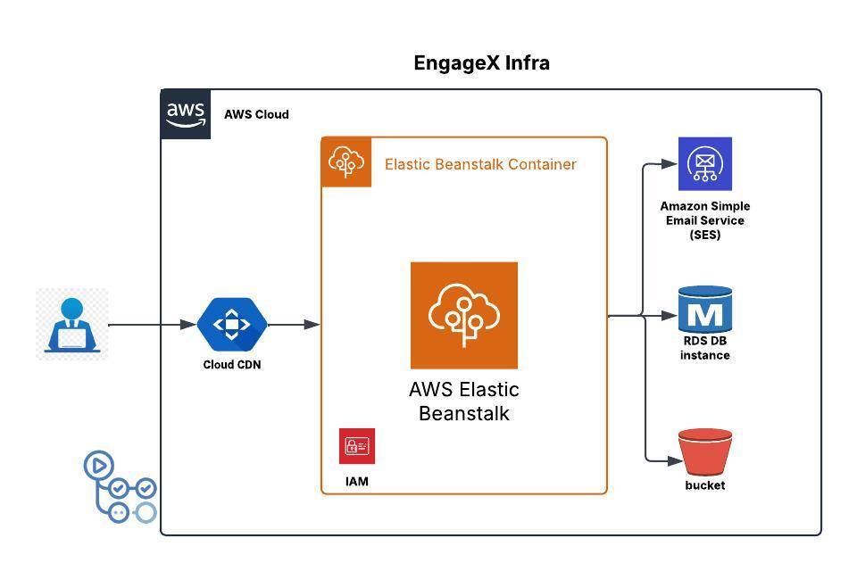

# EngageX API Deployment to AWS Elastic Beanstalk with CI/CD and Secure Resource Access

## 1. Introduction

This document outlines the deployment process for a Python (EngageX App) API to AWS Elastic Beanstalk, including Continuous Integration/Continuous Deployment (CI/CD) via GitHub Actions, secure resource access to Amazon Simple Email Service (SES) and Amazon Simple Storage Service (S3), integration with an Amazon Relational Database Service (RDS) instance, budget alerts, and future production improvements.

## 2. Architecture Overview

* **Engage API:** The backend API developed in Python.
* **AWS Elastic Beanstalk:** Platform as a Service (PaaS) for deploying and managing the API.
* **GitHub Actions:** CI/CD pipeline for automated deployments.
* **Amazon RDS:** Relational database service for data persistence.
* **Amazon SES:** Email sending service for API functionalities (e.g., notifications).
* **Amazon S3:** Object storage for data persistence, secured for internal access.
* **IAM Roles:** AWS Identity and Access Management roles for granting permissions.
* **AWS Budgets:** Cost monitoring and alerting.

  

## 3. Prerequisites

* An AWS account with appropriate permissions.
* A GitHub repository containing the Python API code.
* Python API configured to use environment variables for sensitive data (e.g., AWS credentials, database connections).
* A valid AWS SES setup, and S3 bucket.
* A configured and running RDS instance.

## 4. Deployment Steps

### 4.1. RDS Configuration

1.  **Create an RDS Instance:**
    * In the AWS Management Console, navigate to RDS.
    * Create a new database instance with the appropriate configuration (e.g., database engine, instance type, storage).
    * Ensure the RDS instance is in a VPC that allows access from the Elastic Beanstalk environment.
2.  **Security Group Configuration:**
    * Configure the RDS security group to allow inbound traffic from the Elastic Beanstalk instance's security group.

### 4.2. Elastic Beanstalk Setup

1.  **Create an Elastic Beanstalk Environment:**
    * In the AWS Management Console, navigate to Elastic Beanstalk.
    * Create a new environment (e.g., "Python API Environment").
    * Select the appropriate platform (e.g., Python).
    * Configure environment settings (e.g., instance type, environment variables).
2.  **IAM Role Configuration:**
    * During environment creation, Elastic Beanstalk will create an instance profile (IAM role).
    * Modify the instance profile to grant the necessary permissions:
        * **SES Permissions:** Attach a policy allowing the Elastic Beanstalk instance to send emails via SES.
        * **S3 Permissions:** Attach a policy allowing the Elastic Beanstalk instance to access the specific S3 bucket. Ensure the policy restricts access to the desired bucket and actions.
        * **RDS Access:** Ensure that the security group of the RDS database allows the elastic beanstalk instances to access the database.
3.  **Environment Variables:**
    * In the Elastic Beanstalk environment configuration, set environment variables for:
        * RDS database connection details (host, port, database name, username, password).
        * SES credentials (if applicable).
        * S3 bucket name.
        * Any other sensitive data.

### 4.3. GitHub Actions CI/CD

1.  **Create GitHub Actions Workflow:**
    * In your GitHub repository, create a `.github/workflows` directory.
    * Create a YAML file (e.g., `deploy.yml`) for your workflow.
2.  **Workflow Configuration:**
    * Configure the workflow to:
        * Trigger on pushes to the `deploy` branch.
        * Set up a Python environment.
        * Install dependencies.
        * Create a source bundle for Elastic Beanstalk.
        * Deploy the source bundle to Elastic Beanstalk using the `aws-elastic-beanstalk-deploy` action or the AWS CLI.
    * **AWS Credentials:** Store your AWS credentials as GitHub secrets, and use them within the GitHub action.

### 4.4. SES, S3, and RDS Integration

1.  **Python API Code:**
    * Implement code in your Python API to:
        * Connect to the RDS database using the environment variables.
        * Send emails using the `boto3` library and SES.
        * Store and retrieve data from the S3 bucket using `boto3`.
    * Ensure that the code utilizes the environment variables that are set in the Elastic Beanstalk environment.
2.  **Security:**
    * Avoid hardcoding AWS credentials in your code.
    * Use the IAM role associated with the Elastic Beanstalk instance for authentication.

### 4.5. AWS Budgets

1.  **Create Budget Alerts:**
    * In the AWS Management Console, navigate to AWS Budgets.
    * Create a budget to monitor the cost of the deployed resources.
    * Set up budget alerts to notify you when costs exceed predefined thresholds.

## 5. Verification

* After deployment, access the API via the Elastic Beanstalk environment URL.
* Test API endpoints that utilize RDS, SES, and S3 functionality.
* Check the GitHub Actions workflow logs for any errors.
* Verify the logs of the Elastic Beanstalk application for any errors.
* Verify that the data is being stored and retrieved from the RDS database.
* Verify budget alerts are configured.

## 6. Security Considerations

* Use IAM roles with the principle of least privilege.
* Secure S3 buckets with appropriate bucket policies and access control lists (ACLs).
* Encrypt sensitive data at rest and in transit.
* Secure RDS with security groups and proper user permissions.
* Regularly review and update security configurations.

## 7. Future Production Improvements

1.  **SES Production Access:**
    * Submit a request to AWS to move your SES account out of the sandbox environment to enable sending emails to non-verified addresses.
2.  **IAM Least Privilege:**
    * Tighten IAM policies to grant only the necessary permissions to the Elastic Beanstalk instance, especially for S3 access.
3.  **Production Elastic Beanstalk Environment:**
    * Configure a production-ready Elastic Beanstalk environment with:
        * Multiple EC2 instances for high availability.
        * A load balancer to distribute traffic across instances.
        * Auto Scaling to automatically adjust the number of instances based on demand.

## 8. Troubleshooting

* Check Elastic Beanstalk environment logs for errors.
* Review GitHub Actions workflow logs.
* Verify IAM role permissions.
* Ensure environment variables are correctly configured.
* Check RDS connection logs.
* Verify AWS budget alerts are triggered as expected.
